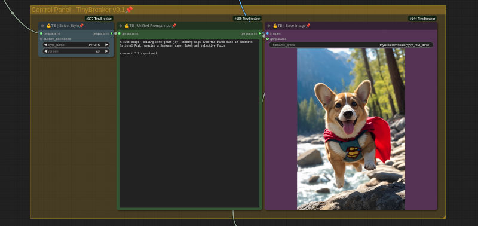

<div align="center">

# ConfyUI-TinyBreaker



<p>


</p>
</div>

**ConfyUI-TinyBreaker** is a collection of custom ComfyUI nodes specifically designed to work with the TinyBreaker model. It is currently under active development, so expect some rough edges and evolving functionality. The nodes are functional, allowing you to explore the potential of the model, but be aware that significant changes are likely between versions as nodes may be completely overhauled.


## What is TinyBreaker?

**TinyBreaker** is a hybrid model that combines the [PixArt model](https://github.com/PixArt-alpha/PixArt-sigma) for base image generation with [Photon model](https://civitai.com/models/84728/photon) (or any SD1 model) for image refinement. The idea is to leverage both models' strengths in these tasks, enabling them to operate efficiently on mid and low-end hardware due to their minimal parameter count. Moreover, by sequentially executing both models, you can offload them to system RAM reducing the VRAM usage. Additionally, TinyBreaker employs [Tiny Autoencoders](https://github.com/madebyollin/taesd) for latent space conversion, optimizing performance and efficiency.


## Models Required

You need to have the following files copied in your ComfyUI application:

- **TinyBreaker_prototype0.safetensors**: Place this file in the `ComfyUI/models/checkpoints` folder.
- **[t5xxl_fp8_e4m3fn.safetensors](https://huggingface.co/Comfy-Org/stable-diffusion-3.5-fp8/blob/main/text_encoders/t5xxl_fp8_e4m3fn.safetensors)**: This text encoder, used for FLUX and SD3.5 as well, should be installed in the `ComfyUI/models/clip` folder (or alternatively in `ComfyUI/models/text_encoders`).


## Installing TB Custom Nodes
> [!IMPORTANT]
> Ensure you have the latest version of [ComfyUi](https://github.com/comfyanonymous/ComfyUI) installed.


### Manual Installation on Linux

To install on a Linux system, follow these steps:

1. Open your terminal.
2. Navigate to your ComfyUI directory:
   ```bash
   cd <your_comfyui_directory>
   ```
3. Move into the `custom_nodes` folder and clone the repository:
   ```bash
   cd custom_nodes
   git clone https://github.com/martin-rizzo/ComfyUI-TinyBreaker
   ```

### Manually Installation on Windows

For those using the standalone ComfyUI release on Windows:

1. Open a command prompt (CMD).
2. Navigate to the "ComfyUI_windows_portable" folder, which contains the `run_nvidia_gpu.bat` file.
3. Execute the following command:
   ```bash
   git clone https://github.com/martin-rizzo/ComfyUI-TinyBreaker ComfyUI\custom_nodes\ConfyUI-TinyBreaker
   ```


## Acknowledgments

I would like to express my sincere gratitude to the developers of PixArt-Σ for their outstanding model. Their contributions have been instrumental in shaping this project and pushing the boundaries of high-quality image generation with minimal resources.

  * [PixArt-Σ GitHub Repository](https://github.com/PixArt-alpha/PixArt-sigma)
  * [PixArt-Σ Hugging Face Model](https://huggingface.co/PixArt-alpha/PixArt-Sigma-XL-2-1024-MS)
  * [PixArt-Σ arXiv Report](https://arxiv.org/abs/2403.04692)

Additional thanks to Ollin Boer Bohan for the Tiny AutoEncoder models. These models have proven invaluable for their efficient latent image encoding, decoding and transcoding capabilities.

  * [Tiny AutoEncoder GitHub Repository](https://github.com/madebyollin/taesd)
  

## License

Copyright (c) 2024-2025 Martin Rizzo  
This project is licensed under the MIT license.  
See the ["LICENSE"](LICENSE) file for details.
  
